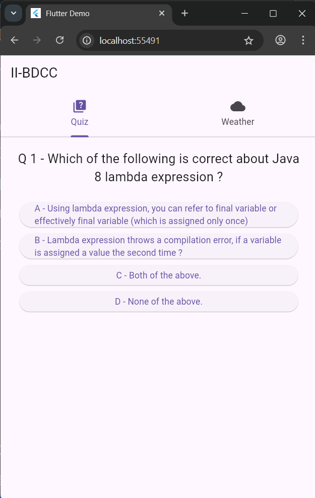

# 📱 HH_Demo Flutter App

A modern Flutter demo project based on the original work by [saadBr](https://github.com/saadBr). This version includes enhancements, customization, and professional structuring.

---

## 🚀 Features

- Flutter clean architecture
- Responsive UI
- API Integration
- Navigation & state management

---

## 🛠 Setup

1. Clone the repo:
```bash
git clone https://github.com/YourUsername/flutter_demo_app.git
cd flutter_demo_app
2. Install dependencies:
flutter pub get
3. Run on Chrome or emulator:
flutter run -d chrome
## 📸 Screenshots




